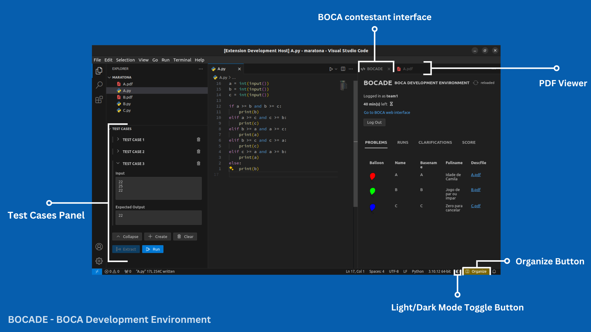
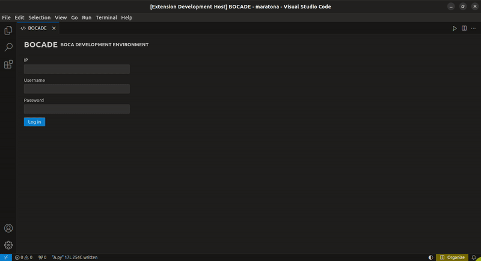
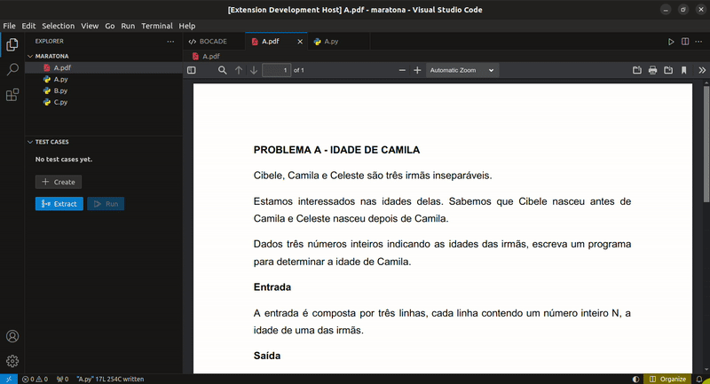
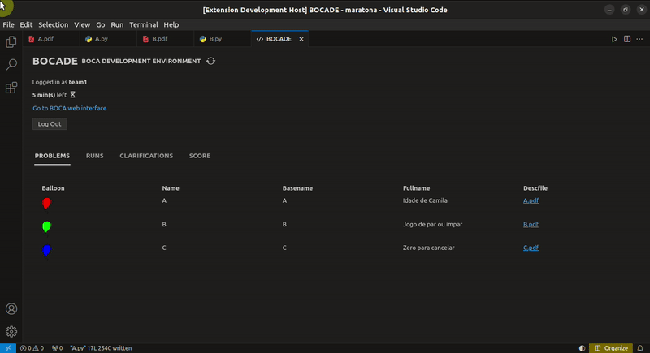
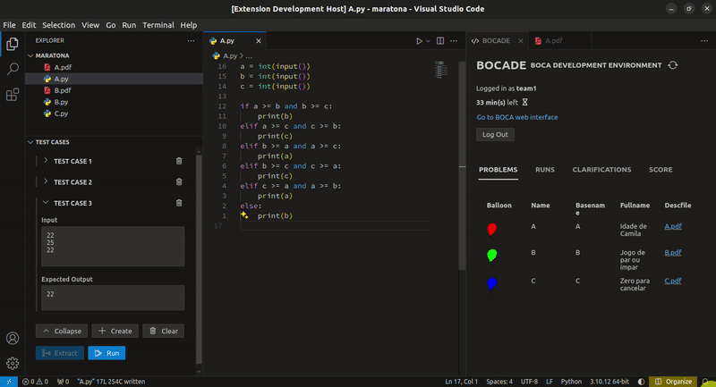

# BOCADE - BOCA Development Environment

VS Code extension for improved UX for participants in programming contests administered by BOCA.

 

## Features

### Integrated BOCA contestant interface and PDF viewer

Eliminate the need to switch between applications.

### Test cases panel

Quickly assess code correctness.

### Organize button

Quickly rearrange editor for optimized navigation.

### Support for light and dark modes and toggle button

 

## How to install on Maratona Linux

> Note on **compatibility**: The extension is compatible with BOCA version 1.5.17 and it has been tested and found to work on Maratona Linux version 20231006, Ubuntu 22.04 and Window 11. It'll probably also work in any OS that's compatible with a recent version of VS Code. This section focus on Maratona Linux because it's the OS commonly used in programming competitions administered by BOCA. However, the instructions below can be adapted for any other compatible OS.

After installing Maratona Linux and set up its communication with the BOCA server ([instructions here](https://github.com/gusalbukrk/boca/tree/main/tutorial)), reproduce the following steps:

1. Log in with the user with administrative privileges — i.e. the user created at the Ubuntu install, before the Maratona Linux installation.
2. Execute `sudo systemctl stop maratona-firewall.service` to stop the firewall.
3. Execute `sudo apt update && sudo apt full-upgrade -y` to update the system.
4. Execute `sudo apt install python3-pip && sudo -H -u icpc pip install --user pdfplumber` to install `pdfplumber` (needed for the PDF test cases extraction functionality to work).
5. Execute `sudo apt install curl && curl -fsSL https://deb.nodesource.com/setup_20.x | sudo -E bash - && sudo apt-get install -y nodejs` to install Node v20 LTS from [NodeSource](https://github.com/nodesource/distributions/blob/master/README.md). If getting error `Failed to run 'apt-get update'` in the `setup_20.x` script execution, it may be due to wrong system time.
6. Download the [`vscode-pdf`](https://marketplace.visualstudio.com/items?itemName=tomoki1207.pdf) and [`bocade`](https://marketplace.visualstudio.com/) extension installers (`.vsix` files) from the VS Code Marketplace.
7. Execute `sudo cp Downloads/*.vsix /home/icpc/Downloads` to copy the downloaded files to inside the `icpc` user's `home` directory.
8. Execute `systemctl reboot` to restart the system in order to reenable the `maratona-firewall`.
9. Log in with the `icpc` user.
10. Open VS Code and install both `.vsix` files by running the command `Extensions: install from VSIX` from the command palette.
